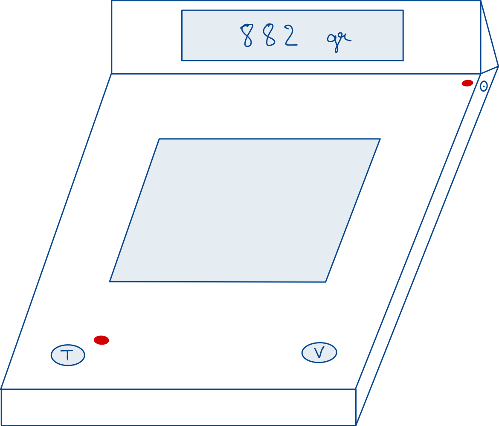

# **Rapport Technique**

Ce projet a ete effectue en groupe de 4 sur une duree de 2 semaines, compose de Antoine JOUY, Alexis VASSEUR, Benjamin BOYER et Theo OLIVER.

## **1. Calcul de résistance :**

### **Buzzer :**

* Le buzzer doit être alimenté en **5 V**.
* Le courant ne doit pas dépasser **30 mA**.
* Choix d’un courant de fonctionnement de **15 mA**.

Utilisation de la loi d’Ohm :

$$
V = R \times I \Rightarrow R = \frac{V}{I} = \frac{5}{0{,}015} = 333\ \Omega
$$

**Résistance à ajouter pour le buzzer : 333 Ω**

**Choix pratique : résistance normalisée de 330 Ω**

Calcul de la puissance :

$$
P = I^2 \times R = (0{,}015)^2 \times 330 = 0.07425\,W
$$

**Dissipation thermique : environ 74,2 mW**

---

## **2. Boutons poussoirs**

### **Résistances de pull-down :**

* Choix d’une résistance de **10 kΩ** (valeur courante).
* Ce choix permet un compromis entre la stabilité du signal et la vitesse de réponse du filtre.
* Objectif : gestion du rebond (debounce) entre **20 ms et 50 ms**.

#### **Dissipation thermique :**

Calcul du courant :

$$
I = \frac{V}{R} = \frac{3{,}3}{10000} = 0{,}00033\,A = 0{,}33\,mA
$$

Calcul de la puissance :

$$
P = I^2 \times R = (0{,}00033)^2 \times 10000 = 0{,}001089\,W
$$

**Dissipation thermique : environ 1,1 mW**

---

### **Condensateurs pour anti-rebond (filtre RC)**

Objectif : obtenir une constante de temps $\tau$ d’environ **6,67 ms** (20 ms ÷ 3)

$$
C = \frac{\tau}{R} = \frac{0{,}00667}{10000} = 667 \times 10^{-9}\,F = 667\,nF
$$

**Valeur normalisée à utiliser : 680 nF**

---

## **3. LED connectée au GPIO 17**

* Tension du GPIO : **3,3 V**
* Tension typique d’une LED rouge : **Vled ≈ 2,0 V**
* Courant souhaité : **I = 5 à 20 mA** (choix : 15 mA)

Calcul de la tension aux bornes de la résistance :

$$
V_R = V_{GPIO} - V_{LED} = 3{,}3 - 2{,}0 = 1{,}3\,V
$$

Calcul de la résistance :

$$
R = \frac{V_R}{I} = \frac{1{,}3}{0{,}015} ≈ 87\,\Omega
$$

**Choix pratique : résistance normalisée de 100 Ω pour réduire le courant.**

### **Dissipation thermique de la résistance :**

Avec R = 100 Ω et I = 15 mA :

$$
P = I^2 \times R = (0{,}015)^2 \times 100 = 0{,}000225 \times 100 = 0{,}0225\,W = 22{,}5\,mW
$$

**Dissipation thermique : environ 22,5 mW (très faible, standard acceptable)**

---

## **4. Alimentation (régulateur 7805)**

### **Condensateurs :**

* Utilisation de **2 condensateurs céramiques** recommandée avec le régulateur **7805** :

  * Un **condensateur de 0,33 µF** en entrée
  * Un **condensateur de 0,1 µF** en sortie

Source : [Analyse du 7805](https://www.ic-components.fr/blog/comprehensive-analysis-and-applications-of-the-7805-voltage-regulator-ic.jsp)

## **Commentaires**

### Choix techniques  
Nous avons choisi de ne pas inclure d’emplacements pour le capteur de pression et l’écran LCD sur le PCB. Cette décision a été motivée par la volonté de réduire au maximum la surface du circuit imprimé, afin de limiter les coûts de fabrication.  
Voici notre vision de la balance :

Concernant la LED d’alimentation, nous avons opté pour une implémentation matérielle simple. Le détail de ce choix est visible dans le schéma d’alimentation.

### BOM  
La nomenclature des composants (BOM) est disponible dans l’archive ZIP fournie. Nous avons volontairement choisi de ne pas indiquer les prix exacts, car ceux-ci peuvent varier entre le moment de la rédaction et l’achat effectif des composants.

### Rapport DRC  
Lors de la conception du PCB, nous avons pris soin de consulter le rapport DRC (Design Rule Check) afin de nous assurer qu’aucune erreur de routage n’était présente. Le résultat final ne présente aucune erreur : le PCB est conforme aux règles de conception.

